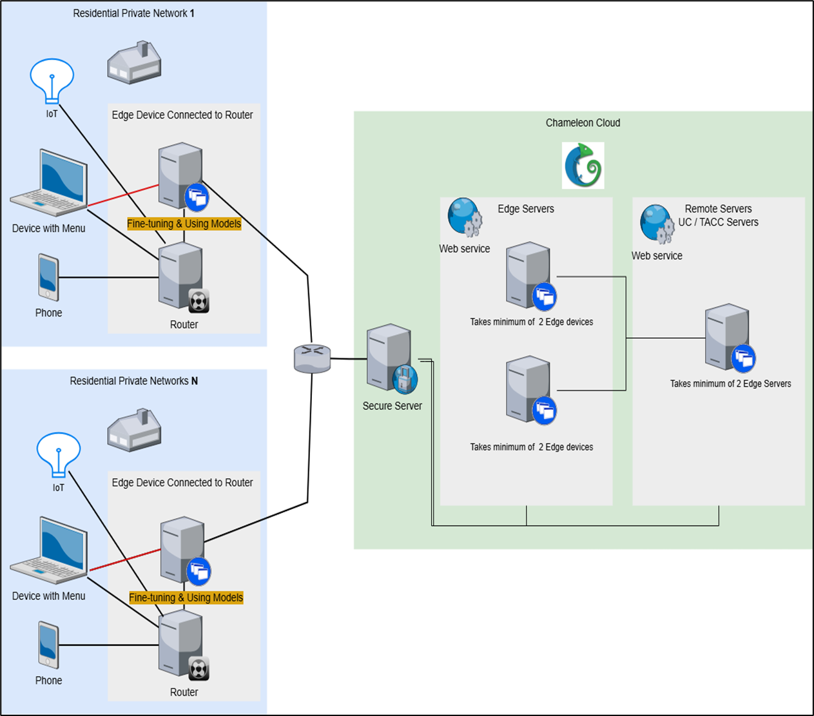
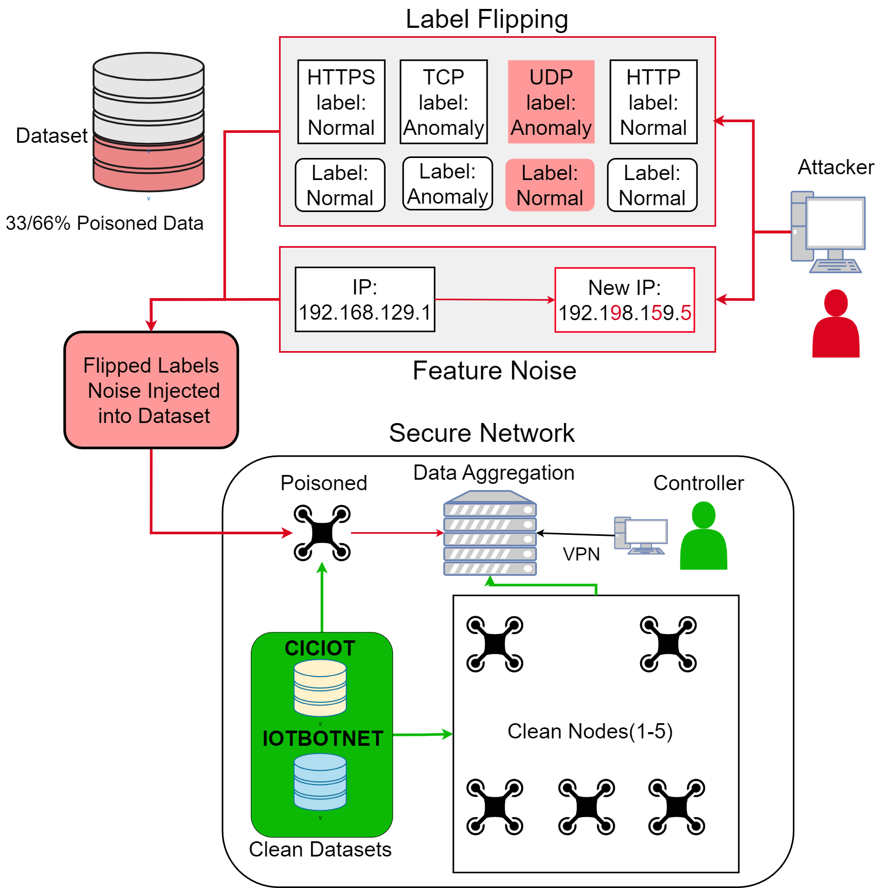

# HFL-DNN-GAN-NIDS

## Faculty Advisors:

* **Dr. Qu, Chenqi (2023-2025)**

* **Dr. Prasad, Calyam (2023-2025)**

* **Dr. Reshmi Mitra (2024-2025)**

## Graduate Mentors:

* **Mogollon, Juan (2024-2025):** Computer Vision Specialist, AI Engineer

* **Haughton, Trevontae (2024):** AERPAW Test-Bed Specialist, FlyPaw Manager, End-to-End Engineer

## Undergraduate Researchers:

* **Kevin Kostage (2023-2025):** Deep Learning Engineer, End-to-End Engineer, Cloud-Network Specialist

* **Paulo Drefahl (2024-2025):** Network Engineer, Cyber-Security Specialist, Full-Stack Developer

* **Sean Peppers (2024-2025):** Deep Learning Engineer, Cyber-Attack Specialist, Experiment Tech.

* **Rohan Adepu (2024):** Cyber-Attack Specialist, Experiment Tech.

* **Jenaya Monroe (2024):** Drone Hardware Specialist, Test-Bed Manager

## Previous Works

**_Federated Learning-enabled Network Incident Anomaly Detection Optimization for Drone Swarms**_
* **Github Repo (Forked Repo)**: https://github.com/rohanadepu/FLVision
* **Under Peer Review**: https://aerpaw.org/publications/

_**Enhancing Autonomous Intrusion Detection System with Generative Adversarial Networks:**_ 
* **Paper:** https://ieeexplore.ieee.org/document/10678662 
* **Github Repo:** https://github.com/Keko787/Generating-a-Balanced-IoT-Cyber-Attack-Dataset-with-GAN-COIL-Collaboration-

**_Enhancing Drone Video Analytics Security Management using an AERPAW Testbed:_** 
* **Paper:** https://ieeexplore.ieee.org/document/10620812

## Purpose
* To develop lightweight Network Intrusion Detection System for Private Networks and IoT Clusters
* To develop secure, scalable, robust training & fine-tuning for Deep Neural Networks and Generative AI
* To utilize Cloud Networking/Computing **_(Chameleon, HiperGator, AERPAW Cloud TestBeds)_** to computationally offload and decentralize training DNN models

## Models 
* Deep Neural Network Binary-Classifier for detecting Network Traffic Intrusions - **Network Intrusion Detection Model/System (NIDM/NIDS)**
* Deep Neural Network Multi-Categorical-Classifier for detecting Network Traffic Intrusions & Synthetic Traffic - **Discriminator (Disc.)**
* Generative Deep Neural Network Model for generating synthetic Network Traffic & Intrusions - **Generator (Gen.)**
* Combined Adversarial Deep Neural Network Generative & Classification Model - **Generative Adversarial Network (GAN)**

## Hierarchal-Federated-Training Pipelines
* GAN model to support other classifiers:
  * The GAN model can be fine-tuned centrally or in a hybrid-decentralized manner.
  * The Classifier model can be finetune in a hybrid-decentralized approach with advance training from the GAN model by augmenting its training data and providing adversarial training.

* Stand-alone decentralized GAN that has separated the sub-models:
  * Training the GAN model with both sub-models together takes a lot of computational resources. Especially the Generator model.
  * Partitioning the GAN model to have the discriminator be fine-tuned hybrid-decentralized approach.
  * The generator will be fined-tuned centrally or in a hybrid-decentralized manner.

* Partitioned GAN Model with a Discriminator with 2 phases of separate training:
  * The Discriminator is classifier that with an output dedicated to determining whether the data is fake or real. This can be selectively trained during the training process, allowing the model to train on classifying less computationally demanding classes.
  * Discriminator Split Training describes the discriminator model having to split the training process between classifying anomalies in network traffic in a hybrid-decentralized manner and discriminating synthetic traffic centrally or in hybrid decentralized manner.

* Each HFL Model Training Pipeline is tested to determine which is the most computationally efficient model & training strategy. 

## Proposed System Architecture
* Smart Home Data Collection
  * The edge devices will be responsible for collecting network traffic data
  * Low-level host servers could provide balanced synthetic generated data to conduct advance training after model aggregation before returning the model to the clients.
  * Another method to send data is to send packets of data on the network modeled by the generative model.

* Edge Data Analysis
  * Edge Devices and low-level host servers will be distributed pretrained model to be fine-tuned.
  * Edge Devices will manage the interactive device management UI.
  * Edge Devices are also responsible for monitoring the network traffic and additional metrics such as usage.

* Cloud Data Interpretation
  * The remote cloud servers will be responsible for pretraining the models and distributing them across the edge servers.
  * The remote nodes will be the high-level host server and manage the overall fine-tuning process.

Figure: Overview of The Hierarchical Federated Learning (HFL) Framework for Smart Home Data Collection, Analysis and Interpretation Using CHI@Edge and Chameleon Cloud Infrastructure

## Propose Network Topology

* The Edge Device is connected to the router to read the network traffic feed of the whole private network.

* A desktop or laptop can have the menu to interact with the Edge Device is deployed.

* The Edge Device is the device responsible for reading the network traffic feed, providing additional insights about the network, and detecting network intrusions using the NIDS system

* The Edge Servers and Remote Servers also have Web-Services to provide metrics and status of the Cloud Servers

* The Edge Servers act as the host for the Edge Device Client Models, while the Remote Server act as the host for the Edge Server Client Models

* To perform Federated Training, it takes a minimum of two Edge Devices or Servers as clients or connecting to the host server

Figure: Topology of Network with Physical Devices and Cloud Nodes

## Experiment Trials
* Experiment 1:
  * Testing deep learning model strategies & hierarchal federated learning training pipelines to determine most efficient computational load and best security.
    * Trial set 1:  HFL Pipeline with dedicated IDS model & Non-Partitioned GAN model
    * Trial set 2: HFL Pipeline with a Partitioned GAN model
    * Trial set 3: HFL Pipeline with a Partitioned GAN model & Partitioned Training Strategy for Discriminator.

* Experiment 2:
  * Testing Cyberattack scenarios with various defense strategies, utility enhancements, & hyperparameter tuning to improve models used in the system.
    * Trial set 1: Defense Strategies
    * Trial set 2: Utility Enhancements & Hyperparameter Tuning
    * Trail set 3: All

* Key Measurements:
  * Hardware Performance Metrics: CPU/GPU Utilization, RAM & VRAM usage, Power/Battery Drain, Bandwidth, Latency
  * Model Performance Metrics: Accuracy, Precision, Recall, AUC-ROC, Log-Cosh
  * System Security: Detection, Detection-Latency, Resilience Against Interception & Adversarial Attacks

## Cyber Attack Pipeline

### Network Attacks
* MITM:
  * Intercepting certain packets transmitted between certain clients and edge resources hosting the training process.
  * DDOS & other detectable attack for the system
  * Attacks that the system is limited to.

### Adversarial Attacks
* Data Poisoning: 
  * Feature Noise Attack on Training Data.
  * Feature Noise Attack on Real Data.

Figure: Data Poisoning Injection Pipeline on AERPAW Server Nodes

## Steps to Run

* **Clone the repo**

* **Run Test Demo with Docker:** 
  * Open terminal in the _DockerSetup_ directory
    *       docker-compose up
  
  * If there was an error, run:
    *       docker build -t flwr-server -f Dockerfile.server.
    
            docker build -t flwr-client -f Dockerfile.client.
    
            docker-compose build
    
            docker-compose up

    
* **Run with AERPAW:**
  * Connect to TestBed:
  
  * Once Connected to the Portable-Server Client Nodes: Go to _FLVision/hflClient_ directory run any of the Client files to initiate the devices to connect to the host server to initiate training 
    *       python3 [name of program]
      * use "--dataset IOTBOTNET" after that statement to use the iotbotnet dataset, if not the script will use the CICIOT Dataset.
  

* Once Connected to the Fixed-Server Host nodes: Go to _FLVision/hflServer/_ to run the various server scripts.
  * To Run the basic server script with no server-side saving.
    *     python3 serverBase.py

## Client Training Process Summary:
  * **Imports / ENV set up**
  * **Script Arguments parsing**
  * **Data Load / Processing CICIOT**
  * * Loading Arguments
    * Feature and Label Mappings
    * Loading
      * Helper Functions
      * Sampling Files & Train/Test Split
      * Extracting to Data from Sampled Files into respective Dataframes
    * Processing
      * Feature Selection
      * Encoding
      * Normalizing
      * X y Split & assigned to model

  * **Data Load / Processing IOTBOTNET**
    * Feature Mappings
    * Loading
    * * Loading Arguments 
      * Helper Functions
      * Loading Specific Attack Data into Dataframes
      * Combine Specific Attacks into a Single Dataframe & Make it Binary Labels
    * Processing
      * Cleaning
      * Train Test Split
      * Feature Selection
      * Encoding
      * Normalizing
      * X y Split & assigned to model
  

  * **NIDS Model Setup**
    * Main Hyperparameter defined
    * CICIOT MODEL Layer structure defined
    * IOTBOTN MODEL Layer Structure defined
    * Default Optimizer & Compile Model
    * Model Analysis

  * **Discriminator Model Setup**
    * Main Hyperparameters defined
    * MODEL Layer Structure defined
    * Default Optimizer & Compile Model
    * Model Analysis

  * **Generator Model Setup**
    * Main Hyperparameters defined
    * MODEL Layer structure defined
    * Default Optimizer & Compile Model
    * Model Analysis

  * **GAN Model Setup**
    * Main Hyperparameters defined
    * Combine defined DISC. & GEN. MODEL Layer structures
    * Default Optimizer & Compile Model
    * Model Analysis
    
    
  * **Initiate Client**

  * **Federated Learning Setup**
    * Client connects to host server to start training process
    * Setting param Def
    * Fitting Model Def
    * Evaluating Model Def
    * Distributes Aggregated Model Back to Clients

## Server Hosting Process
* Load Arguments
* Initiate the gRPC server
* Initiate the Server Config & Strategy

* If performing Centralized Training on Global Model:
  * It will follow same Data loading/processes, model initiation, pipeline in client to properly train.

  

  
